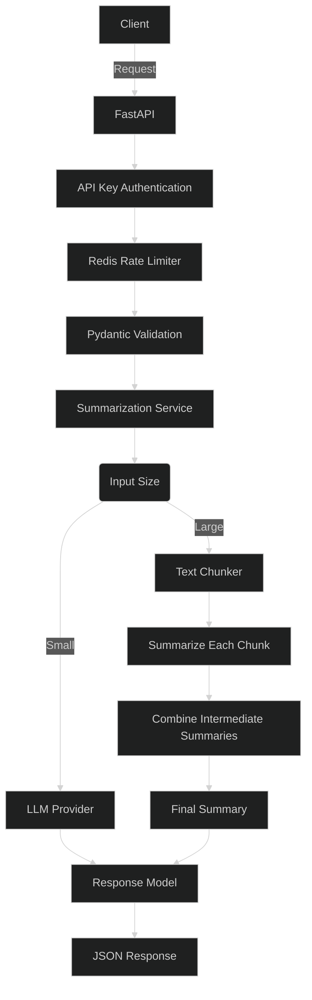
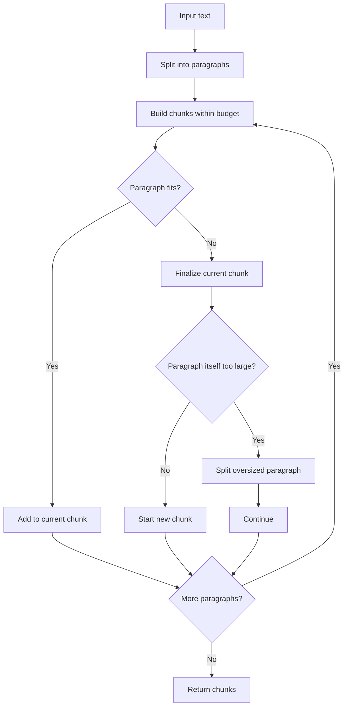

```mermaid
%%{init: {'theme': 'dark'}}%%
flowchart TD
    A[Client] -->|Request| B[FastAPI]
    B --> C[API Key Authentication]
    C --> D[Redis Rate Limiter]
    D --> E[Pydantic Validation]
    E --> G[Summarization Service]
    G --> H(Input Size)
    H --> |Small| I[LLM Provider] --> K[Response Model]
    H --> |Large| J[Text Chunker] --> L[Summarize Each Chunk] --> M[Combine Intermediate Summaries] --> N[Final Summary] --> K
    K --> O[JSON Response]
```

```mermaid
flowchart TD
    A[Input text] --> B[Split into paragraphs]
    B --> C[Build chunks within budget]
    C --> D{Paragraph fits?}
    D -->|Yes| E[Add to current chunk]
    D -->|No| F[Finalize current chunk]
    F --> G{Paragraph itself too large?}
    G -->|Yes| H[Split oversized paragraph]
    G -->|No| I[Start new chunk]
    H --> J[Continue]
    E --> K{More paragraphs?}
    I --> K
    J --> K
    K -->|Yes| C
    K -->|No| L[Return chunks]
```
