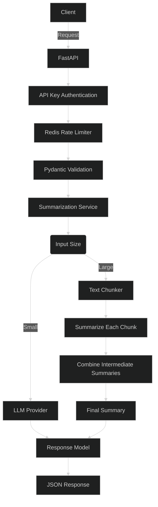

```mermaid
%%{init: {'theme': 'dark'}}%%
flowchart TD
    A[Client] -->|Request| B[FastAPI]
    B --> C[API Key Authentication]
    C --> D[Redis Rate Limiter]
    D --> E[Pydantic Validation]
    E --> G[Summarization Service]
    G --> H(Input Size)
    H --> |Small| I[LLM Provider] --> K[Response Model]
    H --> |Large| J[Text Chunker] --> L[Summarize Each Chunk] --> M[Combine Intermediate Summaries] --> N[Final Summary] --> K
    K --> O[JSON Response]
```
